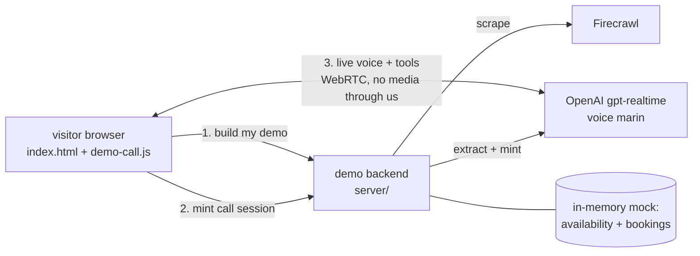
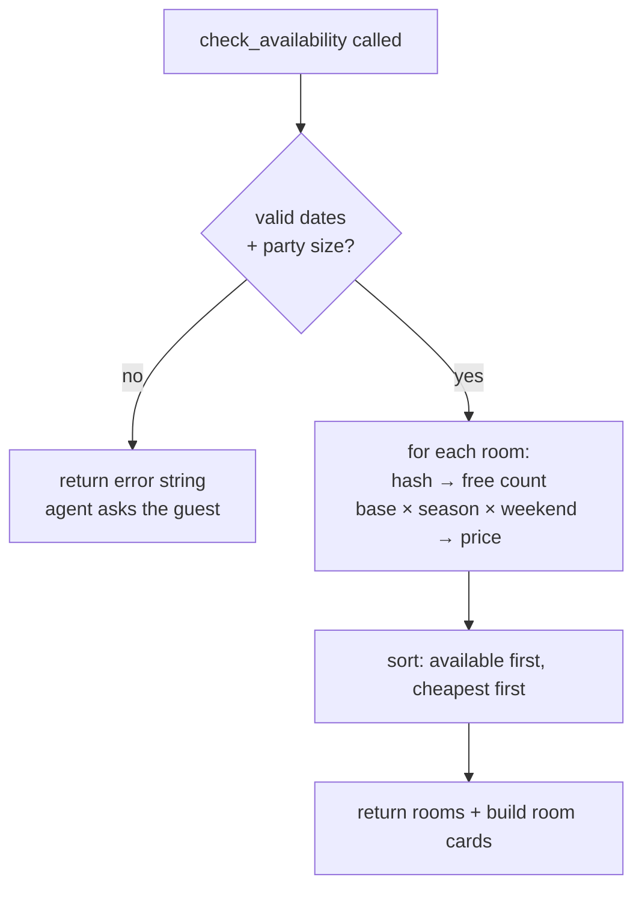
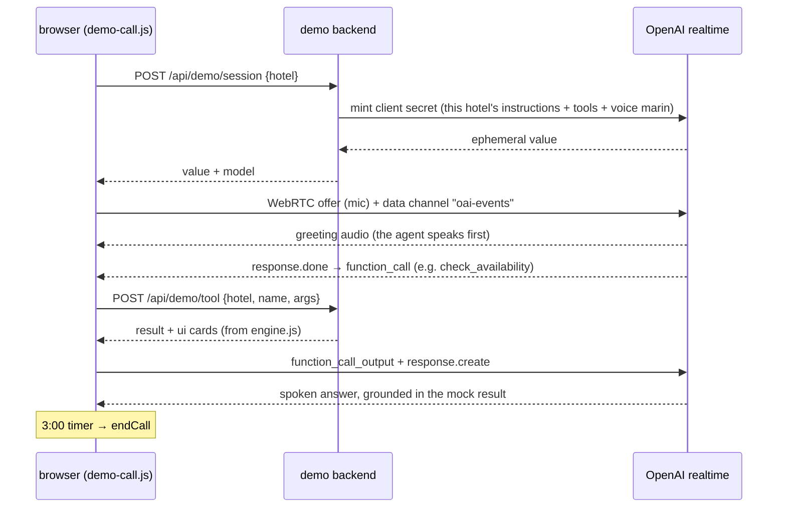
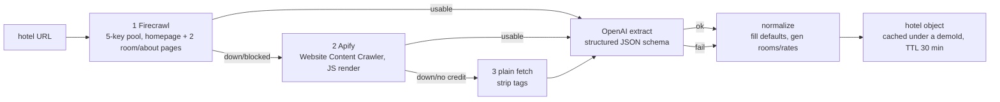
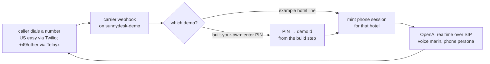

# SunnyDesk demo — build guide

how the live demo on the SunnyDesk site actually works, one build at a time, so you
can fix and upgrade it later without re-reading all the code. this is the canonical
twin of `build-guide.html` (edit one, mirror the other).

---

## the 30-second picture

- the marketing site (`index.html`) is a **static page** — it holds the demo UI but no keys.
- a small **demo backend** (`server/`) holds the OpenAI + Firecrawl keys and does three things:
  scrape a hotel site, mint a voice-call session, and answer mock tool calls.
- the voice call runs **browser ↔ OpenAI directly** (WebRTC) — audio never touches our server.
- **everything hotel-side is mock** — availability and reservations are generated in memory;
  no real database or booking system is ever touched.



---

## the files (what each one is for)

| file | job |
|---|---|
| `index.html` | the whole marketing site + the demo UI (builder form, 3 example cards, call overlay markup lives in CSS). one file, no build step. |
| `demo/demo-call.js` | the browser side of the demo: the builder form, the WebRTC call loop, captions, room cards, the 3-minute timer. |
| `server/server.js` | the demo backend: routes, rate limits, the custom-hotel cache, static file serving. |
| `server/realtime.js` | mints the short-lived OpenAI session (instructions + tools + voice) for one call. |
| `server/instructions.js` | builds the agent's persona prompt for a given hotel + language. **this is the "how human it sounds" file.** |
| `server/engine.js` | the six mock tools + the deterministic availability/pricing engine + tool schemas. |
| `server/scrape.js` | the self-serve builder: scrape a URL (Firecrawl → plain-fetch fallback) → OpenAI extract → hotel object. |
| `server/languages.js` | the list of languages the builder offers. |
| `server/hotels/*.js` | the 3 example hotels — pure data, same shape a scrape produces. |

**one idea to hold onto:** a "hotel" is just a **data object** (see `server/hotels/amber-haveli.js`
for the full shape). The 3 examples are hand-written objects; a scraped hotel is the same object
built at runtime. `engine.js` and `instructions.js` don't care which — that's why there's **one
agent template**, not three.

---

## build 1 — the mock engine (`server/engine.js`)

what it is: the agent's tools. six of them, all pure functions over a hotel object, all in memory.

- `get_hotel_info(topic)` — facts by topic; topic `"rooms"` returns room cards.
- `get_room_details(room_id)` — one room.
- `check_availability(check_in, check_out, adults, children)` — the money tool.
- `make_reservation(...)` — creates a demo booking, returns a reference like `AMB-K4Q7`.
- `get_local_recommendations(interest?)` — things to do.
- `escalate_to_staff(reason)` — hands off + shows the contact card.

how availability is faked (and why it's believable):

- a **deterministic hash** of `(hotel seed, room id, date)` decides how many rooms are free that
  night, so the same date always gives the same answer within a server run (no random flicker
  mid-conversation). ~1 night in 7 is sold out; weekends sell out a bit more.
- price = room `baseRate` × season multiplier × weekend multiplier, rounded. seasons live on each
  hotel object.
- a real `make_reservation` **subtracts** from that night's inventory for the rest of the run, so
  "you just booked the last one" behaves correctly.

fix/upgrade here when: you want different tools, different pricing, or to swap the mock for a real
calendar. the tool **schemas** (what the model is told each tool takes) are at the bottom of this
file in `toolSchemas()` — the model only knows what's written there.



## build 2 — the persona (`server/instructions.js`)

what it is: the prompt that makes the agent sound like a warm human receptionist instead of a bot.
this is lifted from our real hotel deployment's persona, structured per OpenAI's Realtime Prompting
Guide (labelled sections, short CAPITALISED rules, variety + clean-speech rules, hard language pinning).

the key sections it emits, per hotel:

- **language** — the agent leads in the hotel's language and mirrors the guest; never switches on a
  stray word. Hindi/German/English have hand-tuned blocks; every other language uses a generic block
  built from the language name.
- **speech & delivery** — the "sound human" rules: brief affirmations, a thinking pause, a light
  laugh at good news, at most one or two touches per reply, and a hard **clean-speech rule** (never
  put a filler inside a price/date/number).
- **values** — never invent a number; only say what a tool returned this call.
- **booking flow** — collect dates + party → check → offer → confirm → book → read the reference.
- **honesty** — never claim to be human; admit it's a demo if asked; offer escalation for anything
  beyond the demo's tools.

fix/upgrade here when: the agent says something you don't like. **this is almost always a prompt fix,
not a code fix.** change the wording here, redeploy, call it again.

## build 3 — the voice call (`server/realtime.js` + `demo/demo-call.js`)

what it is: the actual phone-like call. the important idea is that **audio never flows through our
server** — it goes browser ↔ OpenAI over WebRTC. our server only mints a short-lived key and runs
the tools.



- the browser opens the call by POSTing its WebRTC **offer** to `https://api.openai.com/v1/realtime/calls`
  using the minted secret, then wires a **data channel** for events.
- when the model wants a tool, it emits a `function_call`; `demo-call.js` calls `/api/demo/tool`,
  sends the result back as `function_call_output`, then `response.create` to let the model speak.
- captions + room cards render from the same events. a **3-minute timer** ends every call.

fix/upgrade here when: the call won't connect (check the minted-session error and the OpenAI key),
or you want a longer/shorter cap (`CALL_CAP_S` in `demo-call.js`), or a different voice
(`REALTIME_VOICE` / `OPENAI_REALTIME_VOICE`).

## build 4 — the self-serve builder (`server/scrape.js`)

what it is: the "point it at your own hotel" flow. it turns a URL into the same hotel data object the
examples use, so the agent instantly knows a real hotel.

the pipeline is a **layered chain** (built for a high-value client — no single provider is a single
point of failure), with fallbacks so it never hard-fails:



the three fetch layers (in `gatherSiteContent`), each independent infrastructure:

1. **Firecrawl** (primary, best quality) — rotates your **5-key pool** so a rate-limited key doesn't
   fail a build, and scrapes **more than the homepage**: it reads the page's links and also pulls up
   to 2 room/about/rates pages (`ENRICH_RE`), which is the single biggest lever on extraction quality.
2. **Apify Website Content Crawler** (independent backup) — a completely separate service, so a
   Firecrawl outage or block doesn't kill the demo. Async run + poll, rotates the Apify token pool.
   **Note:** the free Apify tokens in `.env` are usage-capped (they 403 "hard limit" when spent) — the
   code is wired-and-ready and rotates the pool, but for this to actually serve you need a **funded
   Apify token**. Until then the chain uses Firecrawl → plain fetch (both working today).
3. **plain fetch** (last resort) — a direct HTTP GET + tag-strip; always works for server-rendered sites.

then **OpenAI** (`gpt-4o-mini`, JSON-schema structured output — *not* Anthropic) pulls out the name,
city, rooms, facts, and writes the greeting **in the chosen language**; **normalize** fills anything
missing (no rates → a plausible band by currency; no rooms → a sensible default set). the result is
marked `source: "scraped"` or `"generated"` and the winning `provider` is logged.

the built hotel is cached in memory under a random `demoId` for 30 minutes, then it's gone.

fix/upgrade here when:
- **extraction quality is off** → edit the system prompt + JSON schema in `openaiExtract`, or the
  extraction model (`DEMO_EXTRACT_MODEL`).
- **scrapes miss the rooms** → widen `ENRICH_RE` or raise the enrich-page count in `firecrawlGather`.
- **you want the Apify backup live** → add a funded `APIFY_TOKEN` (and/or `APIFY_TOKEN_POOL`) to the
  Render env; nothing else changes.
- **you want an even stronger scraper** → Firecrawl's own `/extract` (structured, their LLM) or a
  crawl of the whole site are drop-in upgrades to `firecrawlGather`; the rest of the chain is unchanged.

## build 5 — the site UI (`index.html` + `demo/demo-call.js`)

what it is: the visible page. the demo section has two halves — the **builder** (URL + language +
optional agent name → "Build my demo" → a call button appears) and the **3 example hotels** (instant
call buttons). there's also a "No API? No problem." band that makes the no-integration selling point.

- every call button carries `data-demo-hotel="<id>"`; `demo-call.js` binds them all and opens the
  same overlay. a built hotel just gets a `demoId` as its id.
- the demo backend is **free-tier and sleeps**, so the page pings `/api/health` when the demo section
  scrolls into view to pre-wake it, and the call/build buttons show a "waking up…" state if needed.

fix/upgrade here when: you want to restyle the demo, add a setting to the builder (add the field, then
read it in `demo-call.js`'s `buildForm` submit and accept it in `/api/demo/build`), or change the copy.

---

## the moving parts, one table

| piece | choice now | why | change it by |
|---|---|---|---|
| voice model | `gpt-realtime-2.1`, voice `marin` | the exact stack from our real deployment — most human-sounding | env `OPENAI_REALTIME_MODEL` / `OPENAI_REALTIME_VOICE` |
| extraction model | `gpt-4o-mini` | cheap, reliable structured output; **never Anthropic** | env `DEMO_EXTRACT_MODEL` |
| scraper | Firecrawl v2 `/scrape` markdown | handles JS sites; plain-fetch fallback | `firecrawlScrape` in `scrape.js` |
| availability | deterministic hash + seasons | believable + repeatable, zero storage | `engine.js` `freeCount` / `nightlyRate` |
| custom cache | in-memory Map, 30-min TTL, 200 cap | demos are throwaway; nothing to persist | `CUSTOM_TTL` / `CUSTOM_MAX` in `server.js` |
| call cap | 3 minutes | keep OpenAI spend bounded on a public page | `CALL_CAP_S` in `demo-call.js` |
| rate limits | 5 calls & 3 builds / 30 min per IP; daily caps | public endpoint on our bill | `allow(...)` calls + `DEMO_DAILY_*` envs |

## environment variables

| var | needed for | notes |
|---|---|---|
| `OPENAI_API_KEY` | the call + extraction | required; the demo 503s without it |
| `FIRECRAWL_API_KEY` | the self-serve scrape | optional — falls back to plain fetch, then generated data |
| `OPENAI_REALTIME_MODEL` | override the call model | default `gpt-realtime-2.1` |
| `OPENAI_REALTIME_VOICE` | override the voice | default `marin` |
| `DEMO_EXTRACT_MODEL` | override the extractor | default `gpt-4o-mini` |
| `DEMO_DAILY_CALL_CAP` | daily call ceiling | default 60 |
| `DEMO_DAILY_BUILD_CAP` | daily build ceiling | default 120 |
| `PORT` | server port | Render sets this |

## running it locally

```bash
# from the repo root, with the keys in your shell (never commit a .env):
OPENAI_API_KEY=sk-... FIRECRAWL_API_KEY=fc-... PORT=8799 node server/server.js
# then open http://localhost:8799  (the server serves index.html + demo-call.js same-origin)
```

- `/api/health` → shows key presence + which hotels are loaded.
- to test tools without a call: `POST /api/demo/tool {hotel, name, args}` (see the run in
  `human_response/`).
- minting a session (`POST /api/demo/session {hotel}`) costs essentially nothing — it just returns a
  short-lived secret. an actual **call** spends realtime audio minutes, so test those sparingly.

## deploy

- the **static site** (`sunnydesk` on Render) auto-deploys from `main` — the marketing page + demo UI.
- the **demo backend** (`sunnydesk-demo` web service) runs `node server/server.js` from the same repo
  and holds the keys. the frontend finds it at `https://sunnydesk-demo.onrender.com` (see the `API`
  constant at the top of `demo-call.js` — update it if the service name changes).

## roadmap — phone-in (call the agent on a real number)

status: **planned, not built** — blocked on a paid decision (a phone number is real money, and the
telephony can't be end-to-end tested without one). the software pattern is proven in our production
hotel deployment (`Desktop/New folder/server/telephony.js` — Twilio + OpenAI SIP), so this is an
adaptation, not new research.

the shape we'd build:



- **numbers:** a **US Twilio** number is the easy, cheap start (~$1/mo + usage). other countries
  (a German +49, etc.) are available via **Telnyx** (keys already in `.env`, balance currently $0 —
  needs funding). one number per country is plenty for a demo.
- **dynamic routing to a custom demo:** a phone call has no browser context, so after a visitor builds
  their demo on the site we'd show a **number + a short PIN**; they call, enter the PIN (DTMF), and the
  webhook maps PIN → the cached `demoId` and mints that hotel's session. (alternatively, dedicated
  example-hotel lines that skip the PIN.)
- **persona:** `instructions.js` already has the honesty/grounding rules; the phone variant just adds a
  "no screen — speak every value" block (the production `telephony.js` shows the exact pattern).
- **cost control:** same rate limits + a hard per-call minute cap; a phone line is more abusable than a
  web widget, so a per-number daily cap and simple fraud rails matter before it's public.

decision needed to proceed: **which numbers/countries, and the budget** (a US number + usage is a few
dollars a month; testing spends telephony credit). say the word and this becomes a build.

## the honesty rules baked in

- the page labels demo hotels as fictional and says availability/rates are illustrative.
- the agent will admit it's a demo if asked, and is told to offer escalation for anything beyond its
  tools — so it never pretends a demo limit is a real hotel rule.
- **grounding:** the agent may only state numbers a tool returned in that call. that rule is the same
  one that runs in production; here the tools just return mock data instead of a live system.
