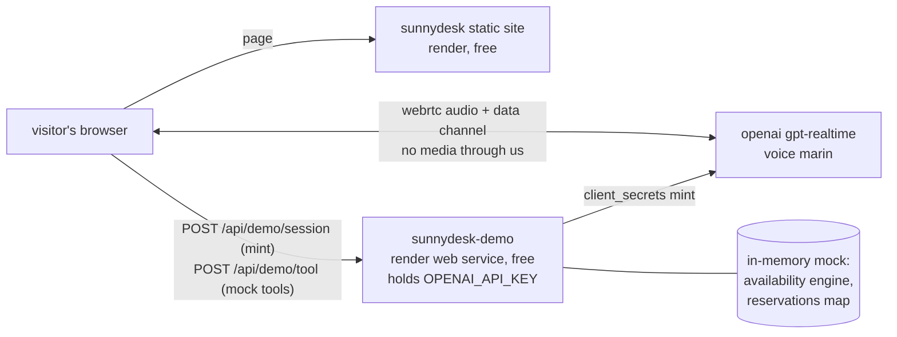
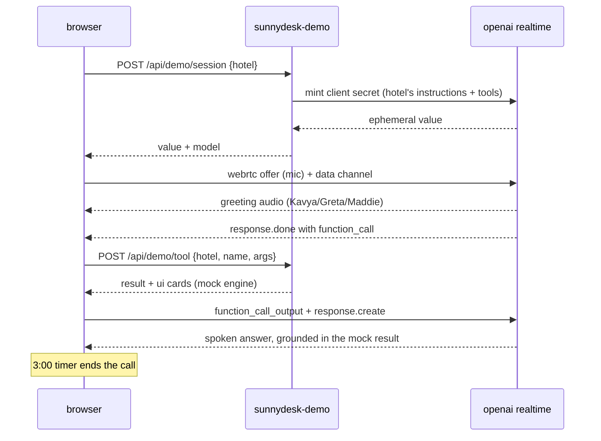

# sunnydesk live demo agents — plan

> **this was the initial plan.** the build went further: it also has a **self-serve builder** (paste
> your hotel URL → we scrape it → a custom agent), a **layered scraper** (Firecrawl → Apify → plain
> fetch), 18 languages, and a **phone-in roadmap**. the living, per-build documentation is
> **`design/build-guide.html`** — read that to fix/upgrade. this file is kept as the original plan record.

three fictional hotels on the site, each with a **callable voice front desk** — the same
gpt-realtime agent (voice **marin**, same persona engineering) that runs at our real hotel
deployment. a visitor taps "call the front desk", talks, hears a human-sounding receptionist
check availability and take a (mock) reservation.

## the three hotels

| hotel | where | agent | leads in | currency |
|---|---|---|---|---|
| The Amber Haveli | jaipur, india | Kavya | hindi (english offered) | INR |
| Hotel Lindenhof | konz-ish, mosel, germany | Greta | german (english offered) | EUR |
| Driftwood Harbour Hotel | vancouver, canada | Maddie | english | CAD |

> **note on "dutch":** the ask said one agent speaks dutch — the hotel is in germany, so this
> is built as **german (deutsch)**. if actually dutch was meant, it's a one-field flip
> (`primaryLanguage` + greeting line in `server/hotels/lindenhof.js`) — the model speaks dutch too.

## what's mock (everything)

- hotels, rooms, rates, contacts — all fictional, clearly labeled "demo hotels" on the page.
- availability — generated deterministically per (hotel, room, date): seasons, weekend bumps,
  ~1 in 7 nights sold out. stable answers within a server run.
- reservations — in-memory only, returns a booking ref like `AMB-K4Q7`, decrements inventory
  for the rest of the run. **no real database, no real booking system, nothing external touched.**

## site upgrade (same single-file style)

- new **"call our demo hotels"** section right after the hero — 3 cards, tap to call,
  live captions + room cards in a panel, 3-minute cap per call.
- new **"runs on whatever software you already have"** band — the no-API story: we put a
  human-sounding agent *in front of* any PMS/booking system, even with zero API access
  (the agent operates the same screens staff use); same system drives kiosks.
- hero gets a "call a demo hotel" CTA; copy tightened.

## hosting + cost control

- static site stays as-is (auto-deploys on push). a new **free** render web service
  `sunnydesk-demo` (same repo, `node server/server.js`) holds the openai key and the mock
  endpoints. free tier sleeps → the page pre-wakes it when the demo section scrolls into view,
  and the call button shows "waking the demo up…" if needed.
- caps: 3 min per call (client timer), per-ip session + tool limits, global daily session cap.
  testing spends no realtime minutes: mint + mock tools only, no live call.

---

## the technical side

one call, end to end:

### pieces / choices

| piece | choice now | why | later / alternative |
|---|---|---|---|
| voice agent | gpt-realtime-2.1 · voice marin · webrtc direct | the exact production stack — proven most human-sounding | swap voices per hotel |
| persona | one shared instruction builder (`server/instructions.js`), park-hotel persona sections (speech texture, clean-values, grounding) parameterized per hotel | one quality bar, three flavors; hotels are data-only modules | per-hotel prompt forks if they diverge |
| tools | 6 mock tools: get_hotel_info, get_room_details, check_availability, make_reservation, get_local_recommendations, escalate_to_staff | enough for a plausible booking conversation, small surface | confirm_reservation lookup |
| availability | deterministic hash(seed, room, date) + season/weekend multipliers, in-memory bookings subtract | plausible + repeatable, zero storage | real calendar feed |
| server | zero-dependency node http (park-hotel pattern), one file + engine + instructions + 3 hotel data files | nothing to install, render-ready | — |
| hosting | new free web service `sunnydesk-demo`; static site unchanged | key can't live in a static site; free = no new spend | starter ($7/mo) kills cold starts |
| frontend | `demo/demo-call.js`, copied call loop from the production widget (offer → /v1/realtime/calls, dc tool loop, caption events) | proven event handling, minimal new surface | — |
| cost caps | 3-min call timer · per-ip 4 sessions/30min · 80 tools/h · 60 sessions/day global | public endpoint on our openai bill | tune after launch |

### decisions to talk about

- **dutch vs german** — built german; say the word and lindenhof flips to dutch.
- **free-tier cold starts** — pre-wake helps, but a stone-cold first call can still wait ~30–50s;
  starter plan on `sunnydesk-demo` ($7/mo) makes it instant, flip anytime.
- **daily cap size** — 60 calls/day ≈ worst case ~3h of realtime audio if everyone talks the
  full 3 min; raise/lower to taste.
- demo hotels show fictional phone numbers/emails — kept obviously non-dialable.
